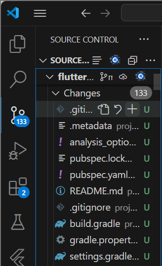
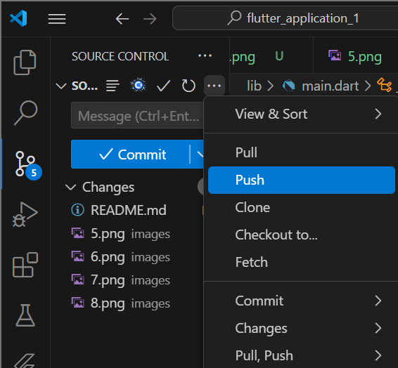

# flutter_application_1

A new Flutter project.

Praktikum 1: Membuat Project Flutter Baru

Langkah 1:
Ketik flutter lalu pilih new project kemudian application 

Langkah 2:
Setelah itu buat folder dan pilih select a folder to create the project in

Langkah 3:
Setelah selesai pastikan tampilan seperti gambar dibawah ini, yang artinya project telah berhasil dibuat.

Praktikum 2: Membuat Repository GitHub
Langkah 1:
Jika sudah login akun GitHub, lalu buat repository dengan nama "flutter-fundamental-part1" kemudian klik create repository 

Langkah 2:
Buka vs code dan pilih projectnya dan klik menu terminal lalu new terminal, setelah itu ketik git init.

Langkah 4:
Pilih menu source control, lalu klik stages (+) pada file .gitignore untuk mengunggah file pertama.

Langkah 5:
Tambahkan pesan commit "add README" lalu centang

Langkah 6:
Kemudian klik titik tiga lalu push

Langkah 7:
Setelah dipush nanti akan tampil di bagian pojok kanan bawah dan klik add remote

Langkah 8:
Push semua file lainnya dengan pilih stage all changes. Nanti akan tampil direpository GitHub.

Praktikum 3: Menerapkan Widget Dasar
Langkah 1: Text Widget
Buatlah folder baru basic_widgets di dalam lib dengan nama text_widget.dart. Lalu import file tersebut ke main.dart dan ganti pada bagian text widget.

Class MyTextWidget adalah subclass dari StatelessWidget, yang bersifat tidak akan berubah atau statis. Di dalam kode tersebut terdapat metode build yang berguna untuk menampilkan widget pada layar. Widget text berguna untuk menampilkan teks.

Langkah 2: Image Widget
Buatlah file image_widget.dart, sesuaikan asset dan tambahkan file logo.

Akan menampilkan logo poliwangi seperti gambar diatas, dan pastikan kode pada main.dart telah disesuaikan seperti di file main.dart

Praktikum 4: Menerapkan Widget Material Design dan iOs Cupertino

Langkah 1: Cupertino Button dan Loading Bar
Buatlah file loading_cupertino.dart, kemudian import stateless widget dari material dan Cupertino.  

CupertinoButton adalah tombol bergaya ios yang akan menampilkan teks "Contoh button", sedangkan CupertinoActivityIndicator adalah indikator bergaya untuk menampilkan animasi loading.

Langkah 2: Floating Action Button (FAB)
Buatlah file fab_widget.dart, kemudian import stateless widget dari material.

FAB adalah tombol aksi mengambang yang berwarna pink, saat ini tidak ada aksi karena onPressed belum diisi.

Langkah 3: Scaffold Widget

Scaffold adalah tombol aksi mengambang yang berada dibawah tengah layar berfungsi sebagai penghitung yang dimulai dari 0.

Langkah 4: Dialog Widget 
Dialog widget pada flutter seperti AlertDialog

Ketika ShowAlert di klik akan muncul sebuah dialog peringatan.

Langkah 5: Input dan Selection Widget

Flutter yang menampilkan sebuah text field atau kolom input teks, kolom ini memiliki label nama.

Langkah 6: Date and Time Pickers
Menampilkan untuk pemilihan tanggal dari kalender

Ketika diklik pilih tanggal akan muncul seperti digambar

